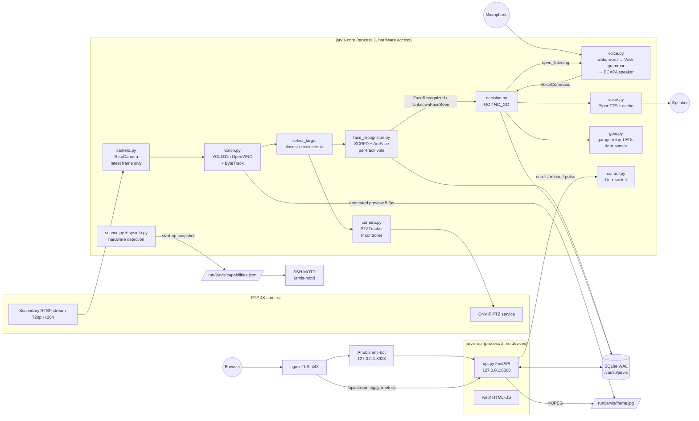

<!--
=============================================================================
Jarvis - Local smart gatekeeper (PTZ camera, face & voice recognition)
-----------------------------------------------------------------------------
File    : docs/ARCHITECTURE.md
Purpose : Architecture document: processes, hardware, pipelines, security, deployment
Author  : Thierry Gayet <thierry.gayet@labworks.fr>
Project : jarvis-home (version: jarvis/VERSION)
Copyright (c) 2026 Thierry Gayet. SPDX-License-Identifier: 0BSD
=============================================================================
-->

# Jarvis: architecture document

A local surveillance and interaction system: a PTZ camera follows people and recognizes faces, an offline voice assistant takes commands, and a USB relay drives the Novoferm Novomatic 200 garage door. Nothing is sent to the cloud.

The software version is defined in a single place, the plain-text file `jarvis/VERSION` (read by `jarvis/__init__.py` and by `pyproject.toml`, bumped with `scripts/jarvis-bump-version.py`). Installation, configuration and day-to-day operation are described in `docs/SOFTWARE.md`.

---

## 1. Overview



The same diagram in ASCII:

```
 Camera ──RTSP──▶ RtspCamera ─▶ YOLO+ByteTrack ─▶ target ─▶ PTZTracker ──ONVIF──▶ Camera
                                     │               │
                                     │               └─▶ SCRFD/ArcFace ─▶ vote ─┐
                                     └─▶ /run/jarvis/frame.jpg ──▶ API (MJPEG)  │
 Mic ─▶ openWakeWord ─▶ Vosk (grammar) ─▶ ECAPA ──────────────────────────────┤
                                                                              ▼
                                   LED / garage relay ◀── DecisionEngine ──▶ Piper TTS ─▶ Spk
                                                                 │
   Browser ─HTTPS─▶ nginx :443 ─▶ Anubis :8923 ─▶ FastAPI :8000 ─┴─ SQLite ◀── Unix socket ─▶ core
                        └──── /api/stream.mjpg, /metrics ────▶ FastAPI
```

### Process split

| systemd service | Role | Access | Why |
|---|---|---|---|
| `jarvis-core` | Vision, voice, decision, hardware | microphone/speaker (`audio`), relay (`dialout`, `plugdev`), VAAPI (`video`, `render`), camera (network); closed `DeviceAllow` list | The only process that owns the hardware and the models. |
| `jarvis-api` | Web UI and REST API on `127.0.0.1:8000` | `PrivateDevices=yes`, no devices at all, `MemoryDenyWriteExecute=yes` | It is exposed through nginx. If it were compromised, it could not drive a relay except through the restricted command set of the control socket. |
| `anubis@jarvis` | Anti-bot proof-of-work proxy on `127.0.0.1:8923` (optional, enabled by default by `deploy/ansible`) | `DynamicUser=yes`, loopback only, no privileges | Keeps crawlers, AI agents and scrapers away from the login page and the UI. |
| `nginx` | TLS, security headers, bot filtering, rate limiting on `/api/login` | ports 80 (redirect, ACME HTTP-01) and 443 | Standard HTTPS termination. |
| `jarvis-cert-renew.timer` | TLS certificate renewal check, twice a day | root, read-only system except the TLS/Let's Encrypt directories | See §6 "TLS certificate lifecycle". |
| `jarvis-backup.timer` | Daily backup of the database and media files (`/var/backups/jarvis`, 14 kept) | `jarvis` user | Recovery. |
| `jarvis-console` | Local appliance console on tty1 (status screen and admin menu) | tty1 | Administration without the network. |

All units are grouped under `jarvis.target`.

The processes communicate over four channels:
- **SQLite in WAL mode** (`/var/lib/jarvis/jarvis.db`): shared persistent state (persons, embeddings, unknown faces, log, accounts, settings).
- **Unix socket** `/run/jarvis/core.sock` (created under umask `0007`, i.e. read/write for the `jarvis` user and group only): requests from the API to the core, one JSON line per request. It accepts a closed list of commands: `status`, `reload_faces`, `reload_voices`, `enroll_face`, `embed_face`, `enroll_voice`, `garage_pulse`, `ptz_home`, `reload_settings`, `system`, `restart`, `say`.
- **Preview file** `/run/jarvis/frame.jpg` (tmpfs): annotated frame, replaced atomically with `os.replace`. The API streams it as MJPEG, so the RTSP stream is decoded only once.
- **Capabilities snapshot** `/run/jarvis/capabilities.json`: at start-up the core runs the hardware detection (`detect_capabilities`, then `apply_auto_performance` in `jarvis/core/sysinfo.py`) and publishes the result through `write_capabilities_snapshot` (called from `jarvis/core/service.py`, next to the control socket). The file is written atomically (temporary file + rename), world-readable (mode 0644, no secrets) and holds a timestamp, the capabilities (CPU model, cores, instruction sets, OpenVINO devices, ONNX Runtime providers, VAAPI decoding) and the automatic performance settings. The SSH MOTD (`deploy/motd/jarvis-motd`) reads it, and falls back to probing the hardware itself when the file is missing. The same data is available to the API through the `system` socket command.

### Threads inside the core

The core uses threads rather than `multiprocessing`. The heavy computation (FFmpeg decoding, OpenVINO, ONNX Runtime, Vosk) runs in native code that releases the GIL. Each library already has its own thread pool, and the models are loaded only once in memory.

| Thread | Rate | Work |
|---|---|---|
| `camera` | stream rate | Continuous `cap.read()`. Only the latest frame is kept, which avoids buffer latency. |
| `vision` | `process_fps` (8) | Detection and tracking, target selection, PTZ, at most 2 faces per frame, preview. |
| `ptz-onvif` | on demand | asyncio loop. Commands are coalesced: only the most recent one is sent, and vision is never blocked. |
| `voice` | 80 ms frames | Wake word, then Vosk session, then speaker verification. |
| `tts` | queue | Piper synthesis with disk cache, audio playback, `speaking` flag for half-duplex operation. |
| `decision` | event queue | GO / NO_GO rules, LEDs, greetings, relay. |
| `control` | on demand | Unix socket server. |
| `maintenance` | every 6 h | GDPR retention purge. |

The core runs as `Type=notify`: it sends `READY=1` once the models are loaded, then `WATCHDOG=1` heartbeats as long as its vital threads and the vision loop are alive (`WatchdogSec=60`); otherwise systemd kills and restarts it.

### Resource accounting and limits

`jarvis-core`, `jarvis-api` and `anubis@jarvis` enable systemd per-unit resource accounting (`CPUAccounting`, `MemoryAccounting`, `IOAccounting`, `IPAccounting`): CPU time, memory, block I/O and network bytes of each unit's cgroup (cgroup v2, eBPF for the IP counters). These counters feed `systemctl status`, the SSH MOTD and `jarvis resources`. The Ansible preflight refuses a host without the unified cgroup v2 hierarchy.

| Unit | Priority and limits |
|---|---|
| `jarvis-core` | `Nice=-5`, `CPUWeight=200`, `IOWeight=200`, `MemoryHigh=3G`, `MemoryMax=4G`, `OOMScoreAdjust=-500` |
| `jarvis-api` | `CPUWeight=50`, `MemoryHigh=384M`, `MemoryMax=512M` (the API must never starve the core) |

---

## 2. Hardware

### 2.1 Lenovo ThinkCentre M73 Tiny (the mini-PC)

The selected mini-PC is the **Tiny** form factor (1 liter, machine types 10AX/10AY/10DK-10DN). The official manuals are in `docs/hardware/lenovo-thinkcentre-m73/`: EN/FR User Guides for the three form factors, HMM, PSREF sheets. The complete wiring is in `docs/diagrams/jarvis-interconnection.pdf` and the bill of materials in `docs/diagrams/jarvis-bom.pdf`. The points that matter here:

- **Haswell "T" CPU (35 W)**. A **quad-core Core i5 or i7** is required: i5-4590T, i5-4460T, i7-4785T or i7-4765T. They support AVX2 and FMA3, which OpenVINO and ONNX Runtime use.
  - The **i5-4570T has only 2 cores** (4 threads): set `detector.imgsz` to 416 and `vision.process_fps` to 4.
  - **Celeron and Pentium parts have no AVX2** and are unusable for real-time vision.
  - `scripts/jarvis-install.sh` prints a warning in both cases (the Ansible preflight also warns when AVX2 is missing).
- **Graphics**. The Intel HD 4600 iGPU is not supported by the OpenVINO GPU plugin, which requires Gen9 (Skylake) or newer. An old AMD card does not offer usable acceleration under Linux for these models either, because ROCm does not support those chips. **The architecture is therefore 100 % CPU**. At best, the iGPU handles H.264 video decoding (VAAPI, `camera.hw_accel: true`).
- **No discrete GPU possible**: the Tiny has no PCIe slot, and its mini-PCIe slot is used by the Wi-Fi card. The pipeline fits on the CPU. If more power is needed later, it is better to change machines (Intel 11th generation or newer with Iris Xe, OpenVINO GPU plugin).
- **RAM**: 8 GB is enough, 16 GB maximum (DDR3).
- **I/O**: no GPIO, hence the USB relays. The rear serial port only exists as an option on some models. The door sensor therefore goes through an **FT232RL TTL** adapter.
- **Ports**:
  - 2 × USB 3.0 on the front: Gigabit adapter for the camera, plus one free port;
  - 3 × USB 2.0 on the back: microphone, relay, sensor;
  - **a single RJ45**, hence the USB 3.0 → Gigabit adapter for the camera network (see `docs/diagrams/jarvis-network-flows.pdf`);
  - power from an external 65 W brick.
- **Audio**: 3.5 mm microphone and headphone jacks on the front, 1.5 W internal speaker, no line-in. Outdoors, the **ReSpeaker USB Mic Array v2.0** is far more reliable. It has acoustic echo cancellation, and its jack output feeds the speaker amplifier.

**Estimated CPU budget** (i5-4590T, 4 cores, 720p stream). These are orders of magnitude to be measured on site, for example with `vision_fps` in the Live tab:

| Stage | Approx. cost |
|---|---|
| H.264 720p decoding @ 15 fps | ~10 % of one core (less with VAAPI) |
| YOLO11n OpenVINO + ByteTrack, imgsz 480 | 60 to 100 ms per frame (89 ms measured on a loaded development PC) |
| SCRFD-500M (320) + ArcFace MobileFaceNet | 20 to 60 ms per face region (59 ms measured) |
| openWakeWord | ~5 % of one core |
| Vosk small-fr, only while listening | ~20 % of one core |
| Piper medium | about 0.3 s of compute per second of speech; cached phrases afterwards |

A target of **5 to 8 analyses per second** is therefore realistic (6 by default). That is more than enough for someone walking toward the door. If it is too heavy, lower `detector.imgsz` to 416. If there is headroom, raise `vision.process_fps`.

### 2.2 PTZ camera

The minimum is **ONVIF Profile S** with PTZ `ContinuousMove`, `Stop` and `GotoPreset`, a secondary RTSP stream in H.264, and IR or starlight night vision.

| Model | Notes |
|---|---|
| Axis Q6075-E | Best ONVIF compliance, with the VAPIX API as a fallback. The most expensive. |
| Hikvision DS-2DF8C842IXS-AEL | Good value for money. Secondary stream: `/Streaming/Channels/102`. |
| Dahua SD6AL445XA-HNR | Equivalent. Secondary stream: `subtype=1`. |

To do on the camera:
- create a dedicated ONVIF user;
- define **preset 1** (view of the entrance);
- **disable the built-in auto-tracking** (otherwise two controllers fight each other);
- set the secondary stream to **1280×720 H.264, 10 to 15 fps**;
- put the camera on an isolated network with no Internet access: 192.168.50.0/24 through the USB-GbE adapter (`eth1`), or a VLAN.

**Why the secondary stream?** Continuously decoding 4K H.265 saturates a Haswell CPU, and the HD 4600 cannot decode HEVC. The missing resolution is compensated by the **PTZ zoom**: the controller zooms in until the person fills about 55 % of the frame height.

### 2.3 Relays, LEDs, sensor (without GPIO)

Recommended wiring: a **4-channel CH340 USB relay board** ("LCUS-4", a few euros).

| Channel | Use |
|---|---|
| 1 | Garage: dry contact wired **in parallel with the wall push button** of the Novomatic 200 |
| 2 | Green LED (12 V indicator + small 12 V power supply) |
| 3 | Red LED |
| 4 | Spare (siren, lighting…) |

Other backends available in `gpio.py`: `hid_dcttech` ("USBRelay" HID boards), `gpiod` (Raspberry Pi, FT232H, MCP2221…) and `mock`.

**Novomatic 200**:
- The wall control is a **low-voltage, dry-contact pulse input**. The relay only **closes this contact for 500 ms**. Locate the "external push button" terminals in the Novoferm manual.
- **Never switch 230 V.** Cut the power before wiring.
- **A single pulse cycles through open / stop / close, in that order.** Without a position sensor, "open" and "close" therefore send the same pulse: saying "open" while the door is already open will **close it**.
- It is therefore **strongly recommended** to add a **reed contact** (magnetic alarm sensor, NO/NC). Two wiring options:
  - between CTS and GND of a **TTL** FT232RL USB-serial adapter (`door_sensor.backend: serial_cts`). CTS has an internal pull-up;
  - on an **RS-232** port (DB9, optional port of the Tiny or USB-DB9 cable): between **DTR (pin 4) and CTS (pin 8)**. Tying CTS to GND does not work with RS-232 levels.

  The decision engine then refuses "open" when the door is already open, and vice versa.
- Anti-crushing safety remains the job of the operator itself: photocells and force detection of the Novomatic.

---

## 3. Vision pipeline

1. **Acquisition**: `RtspCamera` uses OpenCV/FFmpeg with RTSP over TCP and `CAP_PROP_BUFFERSIZE=1`. The thread reads continuously and only exposes the latest frame with a sequence number, so it never falls behind. On a disconnection, it reconnects with a delay that doubles after each failure (exponential backoff, 30 s maximum).
2. **Detection and tracking**: **YOLO11n** (Ultralytics) exported to **OpenVINO FP32**, filtered on the "person" class, with the built-in **ByteTrack** tracker (`model.track(persist=True)`). ByteTrack is a better fit than DeepSORT: there is no re-identification network to run, and it is just as robust for a single camera.
3. **Target selection**: the previous target is kept as long as it is visible, to avoid jumps. Otherwise, the best score `0.6 × size + 0.4 × centrality` wins, i.e. the closest and most central person.
4. **PTZ**: proportional controller aiming at the upper body, with a dead zone (12 %), capped speed and commands limited to 4 per second.
   - Zooming in only happens when the target is centered. Zooming out is triggered when the box touches an edge.
   - With no target for 30 s, the camera returns to preset 1.
   - The gains are deliberately low: the RTSP latency (0.3 to 1 s) would make an aggressive controller oscillate.
5. **Faces**: **InsightFace**, with SCRFD detection and 512-dimension ArcFace embeddings (`buffalo_s` pack).
   - The search is done **only in the upper half** of the "person" box. At most 2 faces per frame, starting with the target.
   - Nothing is analyzed during a PTZ move, because the image is blurred.
   - Quality filters: minimum size 40 px, detection score ≥ 0.6, sharpness (variance of the Laplacian) ≥ 30.
6. **Identification by vote** (`IdentityResolver`):
   - **Known**: 3 observations above the cosine threshold (0.45) for the same person are required. The event is emitted only once per track.
   - **Unknown**: 6 observations with no match at all. The **best frame** of the track is kept, then deduplicated: an unknown face already seen within the hour (similarity ≥ 0.5) is not recorded again. The embedding is stored with the image, so **labeling it in the UI turns it directly into a known face**, with no recomputation.

InsightFace is preferred over `face_recognition` (dlib) and DeepFace: it is significantly more accurate, especially in profile and under IR, faster on CPU thanks to ONNX, and it has fewer dependencies.

---

## 4. Voice pipeline

```
mic 16 kHz ─▶ [half-duplex: ignored while Jarvis is speaking]
           ─▶ openWakeWord "hey jarvis"  (or Porcupine "jarvis")
           ─▶ beep ─▶ Vosk small-fr, restricted grammar (≈10 phrases + [unk])
           ─▶ CommandParser (exact phrase, otherwise keywords ouvr*/ferm* + garage/porte)
           ─▶ [optional] SpeechBrain ECAPA: speaker identification
           ─▶ VoiceCommand ─▶ DecisionEngine
```

The spoken commands are in French (Vosk `small-fr` model, Piper French voice); the keywords above are the French stems for "open" (`ouvr*`) and "close" (`ferm*`) plus "garage"/"porte" (door).

- **Wake word**. The default free wake word is **"hey jarvis"** with openWakeWord. To say **"jarvis" alone**, there are two options:
  - `wakeword.engine: porcupine`, with a free Picovoice key for personal use;
  - a "jarvis" model trained with the openWakeWord notebook, set in `oww_model`.
- **Direct listening**: after a face is recognized, the core listens for **10 s without a wake word**. The session starts once the greeting is over.
- **Vosk grammar**: only the expected phrases are declared. Recognition then becomes very robust to noise: everything else comes out as `[unk]`. Tested chain: phrase synthesized by Piper, recognized by Vosk, command identified correctly.
- **Speaker verification** (`speaker.enabled`): 192-dimension ECAPA voiceprint, compared with the profiles enrolled from the browser (10 s of reading). A short command (1 to 2 s) yields a less reliable voiceprint: the 0.35 threshold is a compromise to be tuned.
- **TTS**: Piper, voice `fr_FR-siwis-medium`, offline. Each phrase is synthesized only once thanks to the cache.

Why these choices rather than those of the initial plan? Coqui TTS has not been maintained since the company shut down. Porcupine requires a key and an account. Vosk in grammar mode is lighter and more robust than Whisper for a handful of fixed commands.

---

## 5. Decision logic

| Event | Action |
|---|---|
| Face **recognized** | Green LED for 5 s. "Bonjour <first name>" **once per day** (`greetings` table). If the person has the `can_open_garage` right, they enter the **60 s authorization window**. Direct listening for 10 s. |
| Face **unknown** | Red LED for 5 s. Image saved under `unknown/YYYYMMDD/`. Optional message. |
| "Open / close the garage" command | **GO** only if: ① an authorized person was seen less than 60 s ago, ② (optional) the voice belongs to **that** person, ③ (if a sensor is fitted) the action is consistent with the door state. The pulse is then subject to a 5 s cooldown between two pulses. |
| NO_GO | Red LED, spoken message "Accès refusé…" (access denied), `voice_denied` event with the reason. |
| Web button | Direct pulse (authenticated user), logged with its author. |

Everything is recorded in the `events` table (log viewable in the UI) **and** in journald.

Smart-home controllers are integrated through the optional MQTT bridge `jarvis/integrations/mqtt.py`: retained status/state topics, event topics (`face_recognized`, `face_unknown`, `garage_pulse`, `voice_denied`…), Home Assistant MQTT discovery (also consumed by openHAB, Domoticz, Jeedom and Node-RED), and inbound commands (`garage_pulse`, `ptz_home`, `say`) only when `mqtt.allow_commands` is enabled and the command token is supplied.

---

## 6. Security

### Threats and countermeasures

| Threat | Countermeasure in place | Limit / recommendation |
|---|---|---|
| **Photo or screen** shown to the camera | 3-frame vote, voice required in addition, 60 s window. Under IR at night, most screens do not show up. | **No liveness detection**: a good-quality paper photo may be enough to pass the face part. Enable `speaker.enabled`. |
| **Replayed voice recording** | An authorized face must also be in front of the camera. | Speaker verification does not detect a replay. |
| Web access from the network | HTTPS, Argon2id, 12 h sessions, HttpOnly/Secure/SameSite=Strict cookie, `X-Jarvis` anti-CSRF header, at most 5 failures per 5-minute window and per IP, plus nginx `limit_req` (10 requests/min, burst 5, HTTP 429), strict CSP, Anubis proof-of-work for browsers, fail2ban `jarvis-login` jail. | **Do not expose port 443 to the Internet.** For remote access, use a **VPN** (WireGuard or Tailscale). |
| Crawlers, AI agents, scrapers | nginx `robots.txt` (`Disallow: /`), `X-Robots-Tag: noindex, nofollow, noarchive, nosnippet, noimageindex, notranslate`, HTTP 403 by user agent (`$jarvis_denied_bot` map), Anubis bot policy (deny lists, challenge for browsers). | A client forging a browser user agent still has to solve the proof-of-work, then authenticate. |
| Compromised API | The API has no devices (`PrivateDevices`). The core only accepts a closed list of commands. systemd hardening. | — |
| Compromised camera | Isolated VLAN, dedicated ONVIF account. | Keep the firmware up to date. |
| Stuck relay or bug | Mandatory cooldown between two pulses, relay released on shutdown, the Novomatic's own safety features. | Keep the original remote control. |

**In short**: this is a **convenience** system, not a certified access control system. The garage must not guard access to the inside of the house without a second lock.

### Request path

```
client ─▶ nginx :443 (TLS, headers, bot UA 403, robots.txt, limit_req on /api/login)
            ├─▶ upstream jarvis_front ─▶ Anubis 127.0.0.1:8923 ─▶ API 127.0.0.1:8000 ─▶ /run/jarvis/core.sock ─▶ jarvis-core
            └─▶ /api/stream.mjpg, /metrics ─▶ upstream jarvis_api ─▶ API 127.0.0.1:8000
```

- **nginx** (`deploy/nginx/jarvis.conf`): the site file is identical on every host; the two host-specific values live in generated snippets under `deploy/nginx/snippets/`: `jarvis-upstream.conf` (`upstream jarvis_front`: Anubis at `127.0.0.1:8923` when it is deployed, otherwise the API at `127.0.0.1:8000`) and `jarvis-server-name.conf` (`server_name`, which must match the certificate names). Port 80 only serves the ACME HTTP-01 files (`/.well-known/acme-challenge/`) and redirects everything else to HTTPS. On 443: TLS 1.2/1.3, HSTS, `nosniff`, `X-Frame-Options: DENY`, `Referrer-Policy: same-origin`, `Permissions-Policy` (microphone for this origin only), CSP, `X-Robots-Tag`, `Cache-Control: no-store`, `server_tokens off`. The dedicated access log `/var/log/nginx/jarvis.access.log` feeds the fail2ban `jarvis-login` jail.
- **Anubis** (`deploy/anubis/`): instance `anubis@jarvis`, configured by `jarvis.env` (`BIND=127.0.0.1:8923`, `TARGET=http://127.0.0.1:8000`, proof-of-work `DIFFICULTY=4`, secure `SameSite=Strict` cookie, `REDIRECT_DOMAINS` rewritten from the certificate names, own metrics on `127.0.0.1:9091`) and by the bot policy `jarvis.botPolicies.yaml`: pathological clients, AI crawlers/agents, headless browsers, search engines and link-preview bots are denied (HTTP 403); `/metrics` is allowed; browser-like clients solve the challenge once (cookie); other non-browser clients (curl, scripts, Home Assistant REST) are passed through, since the API still requires a session or a token. The systemd drop-in `anubis@jarvis.service.d/10-jarvis.conf` hands the root-only signing key `/etc/anubis/jarvis.key` to the dynamic service user with `LoadCredential=` (`ED25519_PRIVATE_KEY_HEX_FILE=%d/ed25519.key`), and adds resource accounting and hardening.
- **Anubis bypass**: `/api/stream.mjpg` (long-lived MJPEG stream, no buffering, session checked by the API) and `/metrics` (Prometheus scrape, bearer token and source address checked by the API) go straight to the API through `upstream jarvis_api`.

### TLS certificate lifecycle

`scripts/jarvis-cert.sh` (installed as `/usr/local/sbin/jarvis-cert`) manages the certificate that nginx serves at stable paths (`/etc/jarvis/tls/jarvis.crt`, `/etc/jarvis/tls/jarvis.key`), in one of two modes remembered in `/etc/jarvis/tls/jarvis-cert.conf`:

| Mode | Use | Details |
|---|---|---|
| `local` (default) | LAN only, no public domain | A private "Jarvis Local CA" (ECDSA P-384, 10 years, **name-constrained** to local names and private IPv4 ranges) signs a server certificate (ECDSA P-256, 397 days) for `.local`/`.lan`/`.home.arpa` names and LAN IPs. The CA is imported once on the client devices (`jarvis-cert export-ca`). Revocation uses a real CA database and a CRL. |
| `letsencrypt` | Public domain name | certbot obtains an ECDSA certificate. The default **DNS-01** challenge (certbot DNS plugin) needs **no inbound port** open on the Internet, so Jarvis stays LAN-only; HTTP-01 is available but requires port 80 reachable from the Internet. |

Sub-commands: `issue`, `renew`, `status` (dates, remaining time, revocation, chain; `--json`, `--remote`), `revoke`, `export-ca`. `jarvis-cert-renew.timer` runs `jarvis-cert-renew.service` twice a day (04:17 and 16:17, randomized delay up to 1 h, persistent): the certificate is renewed when it expires within 30 days (`renew --days-before 30`), nginx is validated and reloaded, then `status --warn-days 7` fails the unit if the result is not valid (visible in `systemctl --failed` and in the MOTD).

### Host security layers

The host is hardened by the Ansible roles (see §8):

- **Firewall** (`firewall` role, nftables, `table inet jarvis_filter`): `ufw` removed, input policy **default-deny** (`policy drop`); loopback, established/related traffic, rate-limited ICMP/ICMPv6, DHCP and optional mDNS from the LAN are accepted; SSH only from `jarvis_admin_networks` with a per-source rate limit (15 new connections/min); HTTP/HTTPS only from `jarvis_lan_networks`; node_exporter (9100) only from the configured monitoring server. The ruleset is validated with `nft -c` before it replaces the file.
- **fail2ban** (`fail2ban` role, nftables ban actions, increasing ban time up to 1 week): jails `sshd` (aggressive mode, systemd journal), `jarvis-login` (401/429 on `/api/login` in the nginx access log), `nginx-botsearch` (nginx error log) and `recidive` (repeat offenders banned on all ports for 1 week).
- **SSH** (`ssh` role): hardening drop-in `/etc/ssh/sshd_config.d/01-jarvis-hardening.conf` (no root login, public key authentication, password authentication only if explicitly enabled, `MaxAuthTries 3`, no forwarding/tunnels, modern key exchange/cipher/MAC algorithms selected from those the installed OpenSSH supports, `LogLevel VERBOSE`), validated with the complete configuration and rolled back if invalid; pre-login **legal banner** `/etc/issue.net` (SSH and local terminals). The preflight refuses settings that would lock the administrator out.
- **Kernel and system** (`hardening` role): sysctl hardening (`kptr_restrict`, `dmesg_restrict`, no unprivileged eBPF, hardened BPF JIT, `kexec_load_disabled`, Yama ptrace scope, protected links/FIFOs, no IP forwarding, no redirects or source routing, reverse-path filtering, martian logging), rare filesystems and network protocols blacklisted, core dumps disabled (they could contain face embeddings or secrets), persistent bounded journal, **auditd** with Jarvis rules (identity files, sudoers, sshd configuration, `/etc/jarvis/`), **AppArmor** enabled, unattended security upgrades, sudo hardening, password quality (`libpam-pwquality`), restrictive umask, cron restricted to root, Ctrl+Alt+Del ignored, clear-text network clients removed.
- **Services**: every Jarvis unit is sandboxed by systemd (`ProtectSystem=strict`, `NoNewPrivileges`, empty capability set, system call filter, restricted address families, closed device policy).

### SSH login banner (MOTD)

`deploy/motd/jarvis-motd` (installed as `/usr/local/bin/jarvis-motd`, called by `/etc/update-motd.d/10-jarvis` through `pam_motd`) prints at each SSH login: the JARVIS ASCII art with a neofetch/fastfetch system summary, live metrics (CPU, memory, disk I/O, network, GPU), the hardware support read from `/run/jarvis/capabilities.json`, the state of the Jarvis services with their per-unit CPU, memory, I/O and network figures from systemd resource accounting, the TLS certificate, the security status and the available commands. A failing probe only hides its own line: the MOTD never blocks a login.

### GDPR (France)

- Faces and voices are **biometric data** (Art. 9). **Strictly household** use falls under the Art. 2 exemption, **provided that the camera only films your own property**. Filming the public road or a neighbor's land takes you out of this exemption. Those areas must then be masked in the camera, which most cameras support.
- Inform visitors, for example with a "video surveillance" sign.
- Features already in place:
  - **retention**: 30 days for unknown faces, 180 days for the log, then automatic purge;
  - **complete erasure** of a person: embeddings, photos, voice;
  - photos re-encoded on import, hence without EXIF or GPS data;
  - nothing is sent to any cloud.
- Obtain the consent of household members before enrolling them.

---

## 7. Storage

```
/etc/jarvis/config.yaml         configuration (640 root:jarvis)
/etc/jarvis/jarvis.env          secrets: camera credentials, Picovoice key
/etc/jarvis/tls/                TLS certificate and key (jarvis-cert), local CA, jarvis-cert.conf
/etc/anubis/                    Anubis instance: jarvis.env, jarvis.botPolicies.yaml, jarvis.key (root 0600)
/opt/jarvis/venv                Python 3.11 + dependencies (read-only at runtime)
/opt/jarvis/src                 source tree (docs/SOFTWARE.md, deploy/)
/var/lib/jarvis/jarvis.db       SQLite: persons, face_embeddings, voice_profiles,
                                unknown_faces, events, greetings, users, sessions,
                                recordings, settings, sightings
/var/lib/jarvis/faces/<id>/     enrollment photos
/var/lib/jarvis/unknown/<date>/ unknown faces
/var/lib/jarvis/voice/<id>/     voice enrollment recordings
/var/lib/jarvis/models/         YOLO OpenVINO, InsightFace, Vosk, Piper, openWakeWord, ECAPA
/var/log/jarvis/                shared file log (rotated by the core)
/var/backups/jarvis/            daily backups (jarvis-backup.timer)
/run/jarvis/                    core.sock, frame.jpg, capabilities.json (tmpfs, 0770 jarvis:jarvis)
```

Python **3.11** is installed by `uv` (`pyproject.toml` requires `>=3.11,<3.13`); the system Python is not used. Some wheels (openWakeWord's tflite-runtime, piper-phonemize) are not available for newer Python versions such as the 3.12 shipped by Ubuntu 24.04.

---

## 8. Deployment and infrastructure as code

The reference platform is **Ubuntu Server 26.04 LTS** (standard security maintenance until May 2031, Ubuntu Pro/ESM until May 2036, Legacy add-on until May 2041). Ubuntu 24.04 is only accepted by the Ansible preflight when `jarvis_allow_ubuntu_2404` is set. Two installation paths exist: `scripts/jarvis-install.sh` (single host, run locally) and the Ansible playbook `deploy/ansible/site.yml` (repeatable, idempotent, remote). The playbook applies these roles in order:

| Role | Purpose |
|---|---|
| `preflight` | Checks before any change: Ansible version, source tree, OS release, architecture, cgroup v2, memory/CPU/disk, AVX2, privilege escalation, lockout protection (SSH key, `AllowUsers`, admin networks), TLS settings, Internet access, ports 80/443, clock synchronization, camera RTSP port. |
| `base` | Package updates, runtime and build packages, mDNS responder (avahi), host name, time zone, clock synchronization. |
| `hardening` | sysctl, module blacklist, core dumps, journal, auditd, AppArmor, unattended upgrades, sudo, PAM password quality. |
| `firewall` | nftables default-deny ruleset. |
| `ssh` | sshd hardening drop-in, administrator keys, legal banner. |
| `jarvis` | `jarvis` user, directories, uv virtualenv (Python 3.11), application, configuration. |
| `tls` | Certificate issuance with `jarvis-cert` (local CA or Let's Encrypt DNS-01), `jarvis-cert-renew.timer`, local CA fetched for the client devices. |
| `anubis` | Anubis download (pinned version and checksum), bot policy, instance environment, signing key, credential/hardening drop-in (when `jarvis_anubis_enabled`). |
| `nginx` | Site file and the per-host upstream/server-name snippets. |
| `fail2ban` | Jarvis login filter and jails. |
| `models` | Download and export of the AI models (when `jarvis_install_models`). |
| `monitoring` | Prometheus node_exporter. |
| `motd` | SSH MOTD (when `jarvis_motd`). |
| `services` | Enabling and starting the Jarvis units. |
| `postflight` | Post-deployment checks: services running and enabled, deployed version, API and Anubis on loopback only, HTTP→HTTPS redirect, TLS versions, security headers, robots handling, Anubis challenge. |

A container test harness (`deploy/ansible/tests/`, Ubuntu 26.04 image) runs the playbook in a container; kernel settings, udev and AppArmor are skipped inside containers. Variables, inventories and usage are documented in `deploy/ansible/README.md`.

---

## 9. Possible future work

- **Liveness detection**: an anti-spoofing model (Silent-Face style) on the face crop, or a blink check.
- **True sound localization**: a ReSpeaker 4-Mic array provides the direction of arrival (DOA), which could be converted into a PTZ preset or angle. For now, `sound_trigger_rms` only triggers on sound level.
- **Event-based video recording**: let the camera record to its SD card, or run Frigate/an NVR in parallel.
- **Newer hardware**: with an Intel 11th generation CPU or newer, set `faces.providers` to `OpenVINOExecutionProvider` and the detector to `intel:gpu`.
